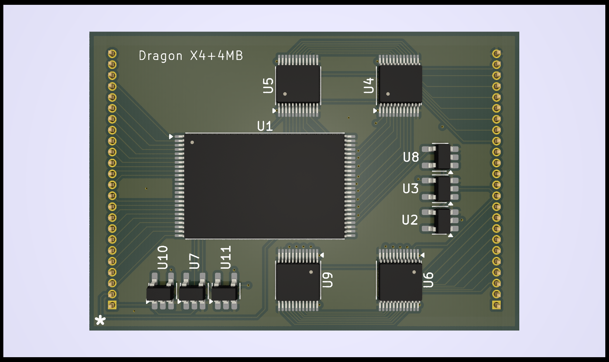

# Dragon 256 rev X4 Plus Memory Card #

This repository contains the hardware design
for a heavily revised Dragon 32 computer
memory board.

The design is most definitely experimental
and absolutely unproven

## Design ##

The board replaces the onboard memory
configuration used in early rev X4 PCBs

The bus connection supports a hypothetical
16MB but this is not currently practical

Even with 4MB on this card that main board
only contains logic to address 1MB but will
be expanded to control the full 4MB ASAP.

The remaining 12MB is intended for expansion
slots.